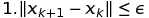

# Лабораторная работа № 6. Безусловный экстремум.

Выполнил студент группы 429 
Гурин Илья Валерьевич

## Вариант № 19
Найти точку **максимума** функции

[x1 = 9, x2 = 25].
метдом **покоординатного спуска**. Для одномерной минимизации использовать, метод **квадратичной интерполяции**. Для поиска интервала унимодальности использовать алгоритм **скользящего окна**. В окрестности точки максимума построить линии уровня и траекторию поиска (на одном графике).

## Теоретическая часть
В начале ставим перед главной функцией "-" (полученную функцию назову МФ - "минусфункция"), 

чтобы мы смогли применить алгоритм нахождения минимума для нахождения максима. Инициализируем начальную точку.
### Метод покоординатного спуска
Фиксируем значения всех переменных кроме xi, получая одномерную функцию f(xi). Проводим одномерную оптимизацию по переменной xi методом квадратичной интерполяции. Если выполен критерий останова, то возвращаем текущее значение x=(x1,x2...xi...xn)
### Критерий останова

Если критерий не выполнен, то повторяем действия.
### Метод квадратичной интерполяции
С помощью скользящего окна находим основную точку, которая лежит в интервале унимодальности. Берём ещё две точки рядом с нашей. Считаем значение МФ в этих трёх точках. Называем xmin минимальной точку ту, значение МФ в которой минимально. Находим среднюю х по следующим формулам

Если условие выполняется:
 ||f(xmin) - f(xaverage))|| < eps
 то эта средняя x точка минимума для МФ(имеется в виду одномерная функция)
 Если условие не выполняется, то основной точкой становится x средняя и всё повторяется.
### Метод скользящего окна
Есть точка x. Выбираем точки справа x-h и слева x+h от неё, считаем значение МФ в этих точках. Сравниваем значения между собой. Если выполняется условие:
f(x-h)>f(x)<f(x+h),
то метод прекращает работу и выдаёт x, если нет, то выполняют следующее.
При f(x-h)>f(x+h), x смещают вправо и процесс повторяется.
При f(x-h)<f(x+h), x смещают влево и процесс повторяется.

## Практическая часть
Функции в программе:
1)Есть главная функция со знаком минус в начале.
2)Две функции (slidingWindow) для поиска интервала унимодальности. Одна для одномерной функции, которая зависит от x1, другая для той, что зависит от x2. На входе точка x1 и x2, одна из них меняться не будет, и шаг. Работа функций - работа скользящего окна. Метод описан в теоретической части. На выходе точка, которая находится рядом с максимумом главной функции (она одномерная).
3)Две функции (quadraticInterpolation), который находит точку максимума. На входе результат работы slidingWindow, константная точка(x1 или x2), шаг. В функции выбираются три точки, считаются значения в этих точках, и это позволяет найти коэффициенты полинома второй степени. Это позволяет найти среднюю x, которая будет с увеличением итераций приближаться к максимуму для главной функции.
4)В фунции main прописан сам метод покоординатного спуска. В ней используются все предыдущие методы. Для одномерной оптимизации - quadraticInterpolation. Для нахождения интервала унимодальности - slidingWindow.

### Результаты
"В результате работы программы у функции 

был найден экстремум в точке [x1 = 27.7994, x2 = 15.8001] (начальная точка [x1 = 9, x2 = 25]) за 4 итераций методом покоординатного спуска с точностью 0.001. Ниже приведен рисунок (рисункИ для случая функции трех переменных) с изображением линий уровня анализируемой функции и траектория поиска экстремума:".

